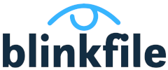

# Blinkfile
Send files quickly and securely.



## Features
- Upload a file and generate sharable links
- Single admin user authentication
- File expiration time can be set by duration or date
- Password-protect file access

## Self-host
Easy [docker compose setup](examples/docker-compose.yml) for your home lab

## Official image
[On DockerHub](https://hub.docker.com/repository/docker/benjohns1/blinkfile)

```
docker pull benjohns1/blinkfile
```

## Run locally
### With Docker
Prerequisites: Docker, Make
#### Test, build & run
```
make
```
#### Test & build
```
make build
```
### On host machine
Prerequisites: Go, NPM, Make

#### Install
```
make install
```
#### Unit test with coverage
```
make test
```
### Open Cypress to run acceptance tests
```
make test-acceptance
```
#### Run
Required environment variables:
- ADMIN_USERNAME
- ADMIN_PASSWORD
```
go run ./...
```